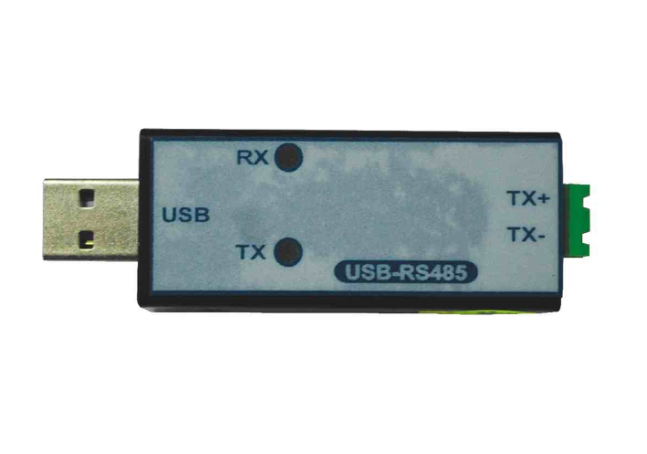

# Industrial End Effector Transmission Directory

## Overview

The measured data from tof sensors is transmitted to the robot control panel using the Modbus protocol. This provides details on the transmission part of the project, including the hardware components used and the steps for data transmission.

## What is Modbus?

Modbus is a serial communication protocol developed for industrial applications to facilitate communication between electronic devices. It is a widely used protocol in the industry due to its simplicity and reliability. Modbus allows multiple devices to communicate over a single serial connection and supports both serial and TCP/IP communications.

## Why Choose Modbus?

Modbus is chosen for this project because:
- It is a standardized protocol widely used in industrial environments.
- It supports communication over long distances with robust error checking.
- It can easily integrate with various industrial equipment and control systems.

## Hardware Components

### MAX485 TTL to RS485 Converter Module

To transmit data from the ToF sensors to the robot control panel, we use the MAX485 TTL to RS485 MAX485CSA Converter Module. This module converts the TTL level signals from the atmega2560 to RS485, which is suitable for long-distance communication.

#### How It Happens
- The MAX485 module converts the TTL signals from the atmega2560 to differential RS485 signals.
- RS485 allows for reliable data transmission over long distances in noisy industrial environments.

#### How to Connect
2. **atmega2560 to MAX485 Module:**
   - Connect the appropriate GPIO pins of the atmega2560 (TX and RX pins, usually pins 18 and 19 for serial communication) to the input pins of the MAX485 module (DI and RO pins respectively).
   - Connect the DE (Data Enable) and RE (Receive Enable) pins of the MAX485 module to a digital pin on the atmega2560 to control the direction of data flow.
3. **MAX485 Module to RS485 Bus:**
   - Connect the RS485 output pins (A and B) of the MAX485 module to the RS485 input of the robot control panel.
4. **Power Supply:**
   - Ensure proper power supply connections to the MAX485 module from the atmega2560 or an external source.

### USB to RS485 Communication Module

For debugging purposes, we use a USB to RS485 Communication Module to connect the system to a PC.

#### How It Works
- The USB to RS485 module converts the USB signals from the PC to RS485 signals.
- This allows the PC to communicate with the RS485 bus, facilitating debugging and testing.

#### Why We Use It
- To monitor and debug the data being transmitted from the sensors to the robot control panel.
- To ensure that the data transmission is working correctly before final integration.

#### How to Connect
1. Connect the RS485 side of the USB to RS485 module to the RS485 bus (parallel connection with MAX485 module).
2. Plug the USB side of the module into the PC.
3. Use a terminal program or Modbus Poll software to monitor the data.

### Modbus Poll Software

For visualization, we use Modbus Poll software, a Modbus master simulator designed to monitor and test Modbus systems.

#### How It Works
- Modbus Poll allows you to send Modbus queries to the devices on the RS485 bus.
- It displays the data received from the devices, enabling real-time monitoring and testing.

#### Why We Use It
- To verify the data being transmitted by the sensors.
- To ensure the integrity and accuracy of the data before it reaches the robot control panel.

#### How to Use
1. Install Modbus Poll software on your PC.
2. Connect the PC to the RS485 bus using the USB to RS485 module.
3. Configure Modbus Poll to match the communication settings of your system (baud rate, parity, etc.).
4. Start the Modbus Poll to monitor and visualize the data.

## Conclusion

Modbus is a reliable and widely-used protocol for industrial communication, making it an excellent choice for transmitting sensor data to the robot control panel. By using the MAX485 converter module and USB to RS485 module, we ensure robust and accurate data transmission. Modbus Poll software further aids in debugging and visualization, ensuring the system functions correctly before deployment.

For more detailed technical information, feel free to contact [me](mailto:uvindukodikara@gmail.com).

